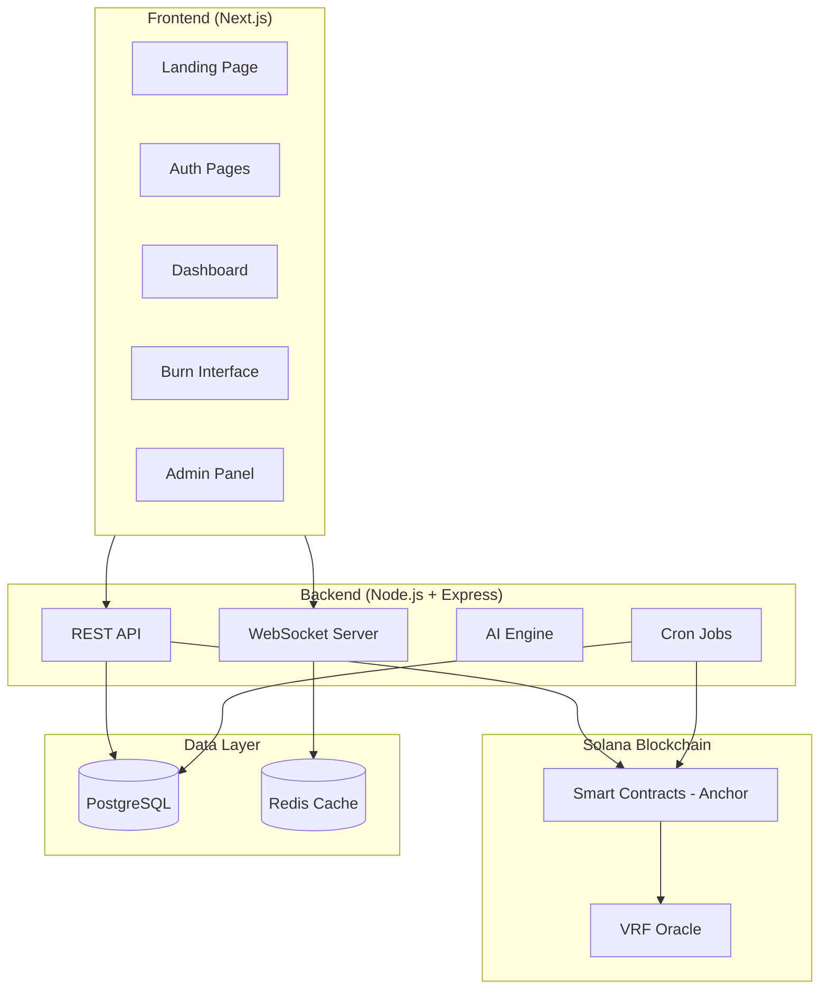
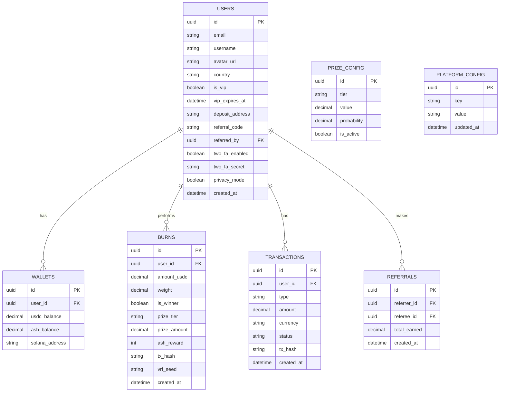
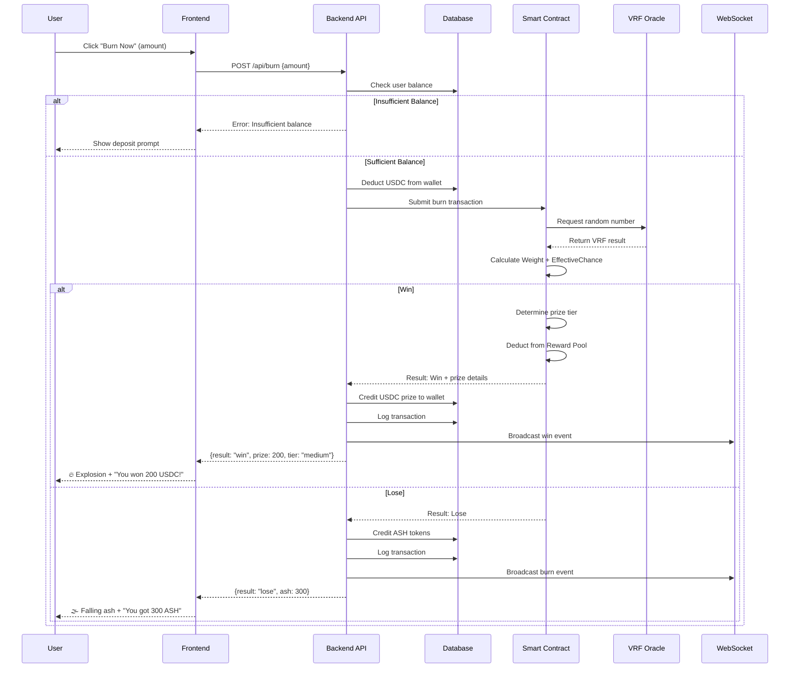

# Ashnance — System Architecture Document

## 1. System Overview

Ashnance is a **"Burn to Win"** gamified platform on Solana where users burn USDC for a chance to win prizes or earn ASH tokens. The platform consists of:



## 2. Tech Stack

| Layer | Technology | Rationale |
|-------|-----------|-----------|
| **Frontend** | Next.js 15 + TypeScript | SSR for SEO, App Router, fast builds |
| **Styling** | Vanilla CSS + CSS Variables | Full control, no framework lock-in |
| **Animations** | Three.js + GSAP + Lottie | 3D fire effects, smooth transitions |
| **State** | Zustand | Lightweight, simple global state |
| **Backend** | Node.js + Express + TypeScript | Fast API, great Solana SDK support |
| **Database** | PostgreSQL + Prisma ORM | Relational data, type-safe queries |
| **Cache** | Redis | Real-time ticker, session management |
| **Blockchain** | Solana + Anchor Framework | Fast, cheap transactions |
| **VRF** | Switchboard VRF | Verifiable randomness on Solana |
| **Auth** | JWT + OAuth2 + Solana Wallet Adapter | Web2 + Web3 auth |
| **2FA** | Speakeasy (TOTP) | Google Authenticator compatible |
| **AI** | OpenAI / Gemini API | Dynamic messages, personalization |
| **TTS** | Web Speech API / ElevenLabs | AI voice for burn results |
| **Real-time** | Socket.IO | Live ticker, notifications |
| **Email** | Nodemailer + SendGrid | OTP delivery |

## 3. Directory Structure

```
ashnance/
├── frontend/                    # Next.js Application
│   ├── app/                     # App Router pages
│   │   ├── (landing)/           # Landing page (public)
│   │   ├── (auth)/              # Login/Register pages
│   │   ├── dashboard/           # User dashboard
│   │   ├── burn/                # Burn Now interface
│   │   ├── wallet/              # Deposit/Withdraw
│   │   ├── referral/            # Referral page
│   │   ├── leaderboard/         # Leaderboards
│   │   ├── settings/            # User settings
│   │   ├── admin/               # Admin panel
│   │   └── api/                 # API routes (if using Next.js API)
│   ├── components/              # Reusable UI components
│   │   ├── common/              # Buttons, Cards, Modals
│   │   ├── layout/              # Navbar, Sidebar, Footer
│   │   ├── effects/             # Fire, Ash, Explosion animations
│   │   ├── dashboard/           # Dashboard-specific components
│   │   ├── burn/                # Burn-specific components
│   │   └── admin/               # Admin-specific components
│   ├── hooks/                   # Custom React hooks
│   ├── lib/                     # Utilities, constants, helpers
│   ├── store/                   # Zustand stores
│   ├── styles/                  # Global CSS, design tokens
│   └── public/                  # Static assets
│
├── backend/                     # Express API Server
│   ├── src/
│   │   ├── controllers/         # Route handlers
│   │   ├── services/            # Business logic
│   │   ├── models/              # Prisma schema + DB models
│   │   ├── middleware/          # Auth, validation, rate-limiting
│   │   ├── routes/              # Express route definitions
│   │   ├── utils/               # Helpers, constants
│   │   ├── websocket/           # Socket.IO handlers
│   │   ├── cron/                # Scheduled tasks
│   │   └── ai/                  # AI message engine
│   ├── prisma/
│   │   └── schema.prisma        # Database schema
│   └── package.json
│
├── contracts/                   # Solana Smart Contracts (Anchor)
│   ├── programs/
│   │   ├── burn-engine/         # Burn + VRF + Prize logic
│   │   ├── reward-pool/         # Pool management
│   │   ├── ash-token/           # ASH SPL Token program
│   │   └── staking/             # Staking contract
│   └── tests/
│
└── docs/                        # Project documentation
```

## 4. Database Schema (Key Tables)



## 5. Core Flow: Burn Operation



## 6. Security Architecture

| Concern | Solution |
|---------|----------|
| Authentication | JWT with refresh tokens + OAuth2 + Wallet signatures |
| 2FA | TOTP (Google Authenticator) mandatory for withdrawals |
| Account lockout | 3 failed attempts → temporary freeze |
| Withdrawal | Requires 2FA + whitelisted addresses |
| Admin access | 2FA mandatory + role-based access |
| VRF | Switchboard on-chain verification — tamper-proof |
| Rate limiting | Express rate-limiter on all endpoints |
| Data validation | Zod schemas for all inputs |
| CORS | Strict origin policy |

## 7. Real-Time Events (WebSocket)

Events broadcast via Socket.IO:

| Event | Payload | Consumers |
|-------|---------|-----------|
| `burn:new` | `{user, amount, result}` | Live Ticker |
| `win:new` | `{user, prize, tier}` | Live Ticker, Leaderboard |
| `deposit:confirmed` | `{user, amount}` | Dashboard |
| `referral:earned` | `{referrer, amount}` | Notifications |
| `leaderboard:update` | `{rankings}` | Leaderboard page |

## 8. Frontend Design Principles

- **Theme**: Dark mode primary with fire/ash-themed accents
- **Colors**: Deep blacks, fiery oranges/reds, golden highlights, ash grays
- **Typography**: Modern sans-serif (Inter or Outfit from Google Fonts)
- **Animations**: GPU-accelerated CSS + Three.js for 3D fire effects
- **Responsive**: Mobile-first, supports all screen sizes
- **Accessibility**: ARIA labels, keyboard navigation, contrast ratios
